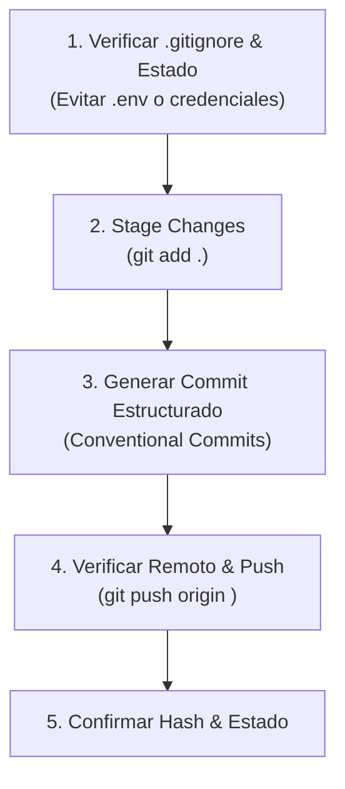

# GitHub Commit & Sync Skill

## Overview

Este skill automatiza el flujo seguro de preparación, confirmación (commit) y sincronización (push) del código y documentación local hacia repositorios en **GitHub**, garantizando mensajes estructurados y protección de secretos.

---

## When to Use

- Cuando el usuario solicita *"guarda los cambios en GitHub"*, *"haz commit y push"*, *"sincroniza con mi repositorio"*, o al finalizar una iteración de desarrollo.
- **Cuando NO usar:** No usar si el usuario no ha solicitado explícitamente sincronizar cambios remotos o si el código actual no compila / rompe pruebas unitarias críticas.

---

## Quick Reference Workflow



---

## Procedimiento Paso a Paso

### 1. Verificación de Seguridad y Estado
Antes de agregar archivos al área de preparación (staging):
1. Asegurarse de que exista un archivo `.gitignore` adecuado en la raíz del proyecto para evitar subir variables de entorno (`.env`), llaves privadas o archivos de datos temporales.
2. Ejecutar `git status` para inspeccionar los archivos modificados, agregados o eliminados.

```powershell
git status
```

### 2. Staging de Cambios
Agregar los archivos modificados al índice de Git:

```powershell
git add .
```

### 3. Generación de Commit Estructurado
Crear un mensaje de commit descriptivo siguiendo la convención **Conventional Commits** (`feat`, `fix`, `docs`, `refactor`, `chore`):

```powershell
git commit -m "docs(nomix): Add product vision and architecture specs"
```

### 4. Sincronización Remota (Push)

#### Opción A: Si existe un script de automatización local (`sync-github.ps1`)
Ejecutar el script pasándole el mensaje de commit:
```powershell
.\sync-github.ps1 "feat: update nomix specs"
```

#### Opción B: Comando Git Estándar
1. Verificar si el remoto `origin` está configurado:
   ```powershell
   git remote -v
   ```
2. Si `origin` existe, realizar el push a la rama activa (ej. `main` / `master`):
   ```powershell
   git push origin main
   ```
3. Si el remoto no está configurado, notificar al usuario con el comando preciso para vincular su repositorio de GitHub:
   ```text
   git remote add origin https://github.com/<usuario>/<repositorio>.git
   git push -u origin main
   ```

### 5. Confirmación al Usuario
Obtener el hash del commit resultante (`git log -n 1`) e informar al usuario el estado de la sincronización con el enlace al commit o rama.

---

## Errores Comunes y Soluciones

| Error | Causa | Solución |
|---|---|---|
| `fatal: No configured push destination` | El repositorio local no está vinculado a GitHub | Solicitar la URL del repositorio remoto al usuario o indicar el comando `git remote add origin <URL>`. |
| `src refspec main does not match any` | No se ha realizado un commit inicial o la rama local se llama `master` | Ejecutar `git branch -M main` y realizar un commit previo antes de empujar. |
| `Updates were rejected because the remote contains work` | Cambios remotos no integrados | Ejecutar `git pull --rebase origin main` antes de volver a intentar el push. |
