# APP-001: PlaniFácil - Resumen y Visión General de la Aplicación

**Documento:** `01_application_overview.md`  
**Estado:** `CONFIRMED`  
**Última Actualización:** 2026-08-25  
**Objetivo:** Especificación técnica y funcional para auditoría, mantenimiento y reconstrucción integral.

---

## 1. Identificación del Sistema

- **ID de Aplicación:** `APP-001`
- **Nombre:** PlaniFácil (Sistema de Planilla Online Panamá)
- **URL de Acceso:** `https://www.planifacil.com/signin`
- **Host de Ejecución de Aplicación:** `https://app.planifacil.com/empresas/`
- **Empresa Activa Observada:** `EL PRINCIPE AZUL, S. A.` (ID Empresa: `2`)
- **Usuario Operador:** `mbarria` (Marisol Barria)
- **Jurisdicción y Marco Legal:** República de Panamá (Código de Trabajo, DGI, Caja de Seguro Social - CSS/SIPE, MITRADEL).

---

## 2. Arquitectura Tecnológica Observada (`OBSERVED`)

| Capa | Tecnología / Mecanismo | Evidencia Observada (`EV-xxx`) |
|---|---|---|
| **Frontend de Autenticación** | HTML5, CSS3, Laravel Blade (`_token` CSRF) en `www.planifacil.com` | `EV-001`: Formulario POST con token CSRF `_token` |
| **Backend de Aplicación** | PHP Clásico (LAMP stack con transiciones a scripts procedimentales y módulos dedicados) | `EV-002`: Endpoints `.php` (ej. `mod_empresa.php`, `plaquincenal.php`, `plaliquida.php`) |
| **Contenedor UI Principal** | Shell tradicional basado en tablas fijas (1200px) con navegación en `#cssmenu` e integración vía `<iframe name="ejecucion" id="ejecucion">` | `EV-003`: `landing_page.html` contiene iframe de ejecución de 1200x1400px |
| **Gestión de Sesión** | Cookies duales: `PHPSESSID` (PHP nativo) + `planifacil_session` y `XSRF-TOKEN` (Laravel) | `EV-004`: Headers `Set-Cookie` en login POST |
| **Librerías Cliente** | jQuery 1.10.2, jQuery UI, jQuery BlockUI (`$.blockUI()`) | `EV-005`: Scripts referenciados en `<head>` de `index.php` |
| **Exportaciones e Informes** | FPDF / TCPDF (generación de PDFs como `pdfplanilla.php`, `pdfcomprob.php`, `pdfcheque.php`), PHPSpreadsheet / CSV / XLS (generación de archivos ACH bancarios y SIPE CSS) | `EV-006`: Endpoints `xls_ach_bac.php`, `gen_ach_banistmo.php`, `rep_sipe.php` |

---

## 3. Topología de Módulos (`MOD-xxx`)

```mermaid
graph TD
    APP["PlaniFácil (APP-001)"] --> M1["MOD-001: Autenticación & Perfil"]
    APP --> M2["MOD-002: Configuraciones"]
    APP --> M3["MOD-003: Mantenimiento Base"]
    APP --> M4["MOD-004: Gestión de Planilla"]
    APP --> M5["MOD-005: Liquidaciones Laborales (Panamá)"]
    APP --> M6["MOD-006: Reportes Legales y Contables"]

    M2 --> C1["Parámetros, Horarios, Días Libres"]
    M2 --> C2["Retenciones, Descuentos, Balances, Cuentas Mayor"]

    M3 --> MA1["Sucursales, Gerencias, Departamentos, Cargos"]
    M3 --> MA2["Acreedores Comerciales e Institucionales"]
    M3 --> MA3["Gestión de Usuarios y Permisos"]

    M4 --> P1["Ficha Integral de Colaboradores (110+ campos)"]
    M4 --> P2["Reloj, Marcaciones y Turnos"]
    M4 --> P3["Planilla Quincenal, Bisemanal y Servicios Prof."]
    M4 --> P4["Incapacidades, Vacaciones, XIII Mes, Horas Extras"]
    M4 --> P5["Generador ACH Multi-Banco"]

    M5 --> L1["12 Causales de Terminación según Código de Trabajo"]
    M5 --> L2["Cálculo de Indemnizaciones, Prima de Antigüedad, ISR"]

    M6 --> R1["DGI (Formulario 03)"]
    M6 --> R2["CSS (Exportación SIPE)"]
    M6 --> R3["Asientos Contables y Reservas Cargas Sociales"]
```

---

## 4. Clasificación de Datos y Certeza

Todas las especificaciones registradas en esta suite documental han sido verificadas en el entorno en vivo y categorizadas estrictamente como:
- `OBSERVED`: Extraído de los formularios, selectores, códigos de estado y respuestas HTTP directas.
- `CONFIRMED`: Validado contra el flujo de navegación de la sesión `mbarria`.
- `INFERRED`: Modelos de base de datos relacional inferidos de los campos `id_empresa`, `id_colaborador`, `id_sucursal`, `id_acreedor`.
- `UNKNOWN`: Esquemas internos SQL y credenciales de bases de datos no expuestas externamente.
