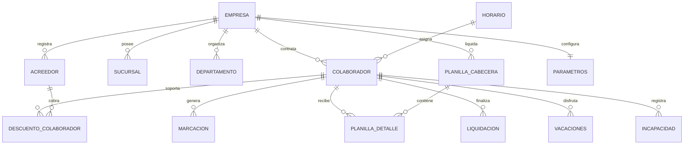

# APP-001: Modelo de Entidades y Diccionario de Datos

**Documento:** `03_entities_and_data_model.md`  
**Estado:** `CONFIRMED` & `OBSERVED`  
**Clasificación:** Reconstrucción de Esquema Relacional

---

## 1. Entidad Principal: Colaborador (`ENT-001`)

Esta entidad representa el perfil completo de un trabajador en la legislación panameña. Descompuesta a partir del formulario `placolaborador.php`.

### 1.1 Atributos Generales y de Identificación

| Campo / Form Control | Tipo Observado | Opciones / Valores Permitidos | Descripción de Negocio |
|---|---|---|---|
| `cod_empleado` | Text / Varchar | String alfanumérico correlativo | Código interno del empleado en la empresa |
| `nombres` | Text / Varchar | String | Primer y segundo nombre del colaborador |
| `apellidos` | Text / Varchar | String | Primer y segundo apellido |
| `sexo` | Select | `Masculino`, `Femenino` | Género para estadísticas de CSS y MITRADEL |
| `estado_civil` | Select | `Soltero(a)`, `Casado(a)`, `Unido(a)`, `Viudo(a)` | Base para deducciones tributarias de cónyuge |
| `fecha_nacimiento` | Date (`YYYY-MM-DD`) | Fecha válida | Cálculo de edad y mayoría laboral |
| `tipo_id` | Select | `Cédula`, `Pasaporte` | Tipo de documento de identidad oficial |
| `id_identificacion` | Text / Varchar | Formato Panamá (ej. `8-123-456`) | Cédula o número de pasaporte |
| `dv` | Text (2 chars) | Dígito Verificador | Dígito verificador de cédula / RUC |
| `seguro_social` | Text / Varchar | Formato CSS Panamá | Número de afiliación a la Caja de Seguro Social |
| `foto` | File (image) | JPEG, PNG | Imagen de perfil para carnet y ficha |

### 1.2 Ubicación Organizacional y Contrato

| Campo | Tipo | Opciones / Relación | Descripción |
|---|---|---|---|
| `id_gerencia` | Select / Foreign Key | Catálogo de Gerencias | Nivel directivo asignado |
| `id_depto` | Select / Foreign Key | Catálogo de Departamentos | Departamento operativo |
| `id_sucursal` | Select / Foreign Key | Catálogo de Sucursales | Sede física de prestación de servicios |
| `id_cargo` | Select / Foreign Key | Catálogo de Posiciones | Cargo nominal del trabajador |
| `tipo_contrato` | Select | `Indefinido`, `Definido`, `Obra Terminada`, `Servicios Profesionales` | Determina el régimen de indemnización y liquidación |
| `tipo_planilla` | Select | `Quincenal`, `Bisemanal`, `Quincenal Pago x Hora`, `Mensual 1ra Qna`, `Mensual 2da Qna` | Frecuencia y ciclo de pago |
| `fecha_ingreso` | Date | Fecha | Fecha de inicio de labores (antigüedad) |
| `fecha_termino` | Date | Fecha (opcional) | Fecha pactada en contratos definidos |
| `p_probatorio` | Select | `Si`, `No` | Aplica período de prueba (hasta 3 meses) |
| `status` | Select | `Activo`, `Vacaciones`, `Licencia`, `Suspendido`, `Cesante` | Estado del trabajador en el ciclo de nómina |

### 1.3 Régimen Salarial y Horario

| Campo | Tipo | Opciones / Rango | Descripción |
|---|---|---|---|
| `salario_mensual` | Decimal(10,2) | Valor monetario (USD) | Salario pactado mensual |
| `salario_hora` | Decimal(8,4) | Valor monetario (USD) | Salario por hora calculado (`salario_mensual / horas_mensuales`) |
| `horas_mensuales` | Decimal(6,2) | Estándar: `208.00`, `192.00` | Horas base mensuales contratadas |
| `horas_diarias` | Decimal(4,2) | Estándar: `8.00`, `7.00`, `7.50` | Jornada diurna, mixta o nocturna |
| `horas_sabado` | Decimal(4,2) | Estándar: `4.00`, `0.00` | Horas pactadas para sábados |
| `contratoxhoras` | Select | `Si`, `No` | Modalidad de pago estrictamente por horas marcadas |
| `gasto_rep` | Decimal(10,2) | Valor monetario | Gastos de Representación (gravan ISR separado) |
| `id_horario` | Select / Foreign Key | Catálogo de Horarios | Plantilla horaria para comparación de marcaciones |
| `marca_reloj` | Select | `Si`, `No` | Indica si procesa asistencia por biométrico |
| `cod_reloj` | Text / Int | ID en reloj biométrico | Código de identificación en el hardware de marcación |

### 1.4 Configuración Tributaria y Bancaria

| Campo | Tipo | Opciones | Regla de Negocio |
|---|---|---|---|
| `declara_renta` | Select | `Si`, `No` | Indica si está sujeto a retención de Impuesto Sobre la Renta |
| `grupo_renta` | Select | `A`, `B`, `C` | Tabla de retención DGI según dependientes |
| `dependientes` | Integer | 0 a 10 | Deducción de $250 anuales por dependiente para cálculo de ISR |
| `conyugue_renta` | Select | `Si`, `No` | Deducción de $800 anuales por cónyuge no perceptor |
| `omitir_imp` | Select | `No`, `Si`, `Impuestos en Salario Base` | Exenciones especiales de ley |
| `omitir_rec_domingo`| Select | `No`, `Si` | Exención de recargo de domingo en turnos rotativos |
| `pago_dec` | Select | `Si`, `No` | Sujeto al cálculo y cobro de XIII Mes |
| `forma_paga_colab` | Select | `Cheque`, `Depósito/ACH`, `Efectivo` | Mecanismo de desembolso de nómina |
| `id_banco` | Select / Foreign Key | Bancos de la plaza panameña (BAC, BG, Banistmo, etc.) | Banco destino para ACH |
| `tipo_cta_banco` | Select | `Ahorro`, `Corriente` | Tipo de cuenta bancaria del empleado |
| `cuenta_bancaria` | Text / Varchar | Número de cuenta | Número para generación de archivo ACH |

---

## 2. Entidad: Descuentos y Acreedores de Empleado (`ENT-005`)

Gestiona las deducciones aplicables a un trabajador (préstamos bancarios, mueblerías, pensiones alimenticias, embargos judiciales).

| Campo | Tipo | Opciones | Descripción |
|---|---|---|---|
| `cod_acre` | Select / Foreign Key | Catálogo de Acreedores | Institución o beneficiario del descuento |
| `tipo_descto` | Select | Tipos de descuento | Comercial, Personal, Judicial, Pensión |
| `frecuencia_descto`| Select | `Quincenal`, `Sólo Primera Quincena`, `Sólo Última Quincena` | Momento de deducción |
| `monto_total` | Decimal(10,2) | Valor | Monto original de la deuda (si aplica plazo) |
| `letra_mensual` | Decimal(10,2) | Valor | Cuota mensual o quincenal a descontar |
| `monto_descto` | Decimal(10,2) | Valor | Monto retenido por ciclo |
| `fecha_ini` | Date | Fecha | Inicio del descuento |
| `fecha_fin` | Date | Fecha | Vencimiento del descuento |
| `aplica_dic` | Select | `Si`, `No` | Indica si descuenta en la partida de XIII mes de Diciembre |
| `descto_status` | Select | `Activo`, `Cancelado`, `Suspendido` | Estatus operativo de la deducción |

---

## 3. Entidad: Parámetros de Empresa (`ENT-003`)

Configuraciones globales que rigen los cálculos y automatizaciones de la empresa activa.

| Campo | Tipo | Valores Observados | Impacto en el Cálculo |
|---|---|---|---|
| `tolerancia` | Integer | Minutos (ej. `5`, `10`) | Margen de gracia antes de penalizar tardanza |
| `tiempo_min_hrx` | Integer | Minutos (ej. `15`, `30`) | Umbral mínimo para computar una hora extra |
| `cod_empleado_consec` | Boolean | `Si` / `No` | Autoincremento automático del código de colaborador |
| `id_banco_ach` | Select / FK | BAC, Banco General, Banesco, etc. | Formato bancario por defecto para exportación ACH |
| `comprobante` | Select | `Tradicional`, `Contable`, `Especial` | Formato visual del talonario de pago |
| `decimo_salario_base` | Select | `Si` / `No` | Si el XIII mes usa únicamente salario base o incluye variables |
| `serv_prof_aparte` | Select | `Si` / `No` | Generación separada de planilla de honorarios |
| `ini_semana` | Select | `Lunes`, `Martes`, `Miércoles`... | Día de corte para jornadas y horas semanales |

---

## 4. Diagrama Entidad-Relación (Inferido & Confirmado)

