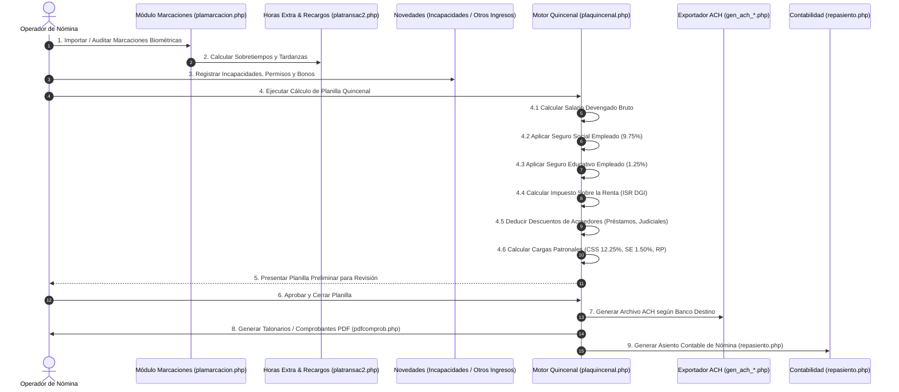

# APP-001: Workflows de Planilla, Prestaciones y Liquidaciones

**Documento:** `04_payroll_and_liquidation_workflows.md`  
**Estado:** `CONFIRMED` (como observación de PlaniFácil) / `SUPERSEDED` (como fuente normativa)  
**Legislación:** Código de Trabajo de la República de Panamá, Leyes de CSS y DGI

---

> ## ⚠️ AVISO DE VIGENCIA — LEER ANTES DE IMPLEMENTAR
>
> Este documento registra **lo observado en PlaniFácil** durante la ingeniería inversa. Su valor es forense, no normativo.
>
> **Para cualquier implementación, la fuente de verdad es [`docs/nomix/06_base_legal_panama.md`](nomix/06_base_legal_panama.md)**, que fue verificada contra fuentes oficiales (DGI, CSS, MITRADEL) el 2026-08-26.
>
> Discrepancias detectadas en este documento:
>
> | § | Afirmación aquí | Verificado |
> |---|---|---|
> | 1.1.3 | CSS patronal **12.25%** | **13.25%** desde abril 2025 (Ley 462 de 2025) |
> | 1.1.4 | Deducción de **$250 por dependiente** | **No existe** en el instructivo oficial de la DGI |
> | 1.1.4 | **$800 por cónyuge no perceptor** | Es la deducción básica de cónyuges en **declaración conjunta** |
> | 1.1.5 | Gastos de repr.: *"10% fijo o escala especial"* | **10% hasta B/.25,000; B/.2,500 + 15% sobre el excedente** |
> | 3.1.2 | Fórmula de prima con divisor `/1` | Malformada — ver §8.1 de la base legal |
> | 3.1.3 | *"Siguientes años: escalas progresivas"* | **3.4 semanas/año** los primeros 10 años; **1 semana/año** después |
> | — | Recargo de domingo **ausente** | **+50%** (Art. 48) |
>
> Las correcciones están marcadas en línea con 🔴 a lo largo del documento.

---

## 1. Workflow de Procesamiento de Planilla Quincenal (`WF-001`)



### 1.1 Fórmulas Matemáticas y Reglas de Deducciones de Ley en Panamá

1. **Seguro Social Obrero (CSS):**
   $$\text{CSS}_{\text{obrero}} = \text{Salario Bruto Gravable} \times 9.75\%$$

2. **Seguro Educativo Obrero (SE):**
   $$\text{SE}_{\text{obrero}} = \text{Salario Bruto Gravable} \times 1.25\%$$

3. **Cargas Patronales:**
   $$\text{CSS}_{\text{patronal}} = \text{Salario Bruto Gravable} \times 12.25\%$$
   $$\text{SE}_{\text{patronal}} = \text{Salario Bruto Gravable} \times 1.50\%$$
   $$\text{Riesgos Profesionales (RP)} = \text{Salario Bruto} \times \text{Tasa\_RP\_Empresa}\%$$

   > 🔴 **DESACTUALIZADO.** La cuota patronal de CSS es **13.25%** desde abril de 2025 (Ley 462 de 18 de marzo de 2025), y escalona a 14.25% en marzo 2027 y 15.25% en marzo 2029. El 12.25% estuvo vigente hasta marzo de 2025.
   > La tasa de RP tiene rango verificado de **0.56% a 6.25%** según CIIU (Resolución JD-CSS 12,260-2024).

4. **Impuesto Sobre la Renta (ISR Empleados - DGI Panamá):**
   - Renta Anual Gravable Estimada = $(\text{Salario Mensual} \times 13) - \text{Deducción Cónyuge (\$800)} - (\text{Dependientes} \times \$250) - \text{CSS anual}$.
   - De $\$0.00$ a $\$11,000.00$: **Exento (0%)**.
   - De $\$11,000.01$ a $\$50,000.00$: **15%** sobre el excedente de $\$11,000.00$.
   - Más de $\$50,000.00$: **\$5,850.00 + 25%** sobre el excedente de $\$50,000.00$.
   - Cuota Quincenal de ISR = $\text{ISR Anual Calculado} / 24$.

   > 🔴 **La tabla de tramos es correcta. La fórmula de la base NO.**
   > - **No existe deducción de \$250 por dependiente.** El instructivo oficial de la DGI (*Renta Natural — Asalariado Puro*, e-Tax 2.0) enumera las deducciones personales de forma exhaustiva y no la incluye.
   > - Los **\$800 no son "por cónyuge no perceptor"**: son la deducción básica de los cónyuges cuando presentan **declaración conjunta** (Art. 709 num. 2 CF, mod. Art. 25 Ley 8 de 2010).
   > - El multiplicador $\times 13$ presupone el XIII Mes dentro de la base anual, lo que **puede duplicar el gravamen** ya que el XIII también se retiene al pagarse. Método de retención pendiente de confirmación profesional.

5. **Gastos de Representación:**
   - No gravan CSS ni SE.
   - Gravan ISR de Gastos de Representación: 10% fijo (o escala especial según tramo).

   > 🔴 **Ambigüedad resuelta.** No es "o": es una **escala de dos tramos** (Art. 701 lit. l CF, Ley 8 de 2010):
   > - Hasta B/. 25,000.00 → **10%**
   > - Más de B/. 25,000.00 → **B/. 2,500.00 + 15%** sobre el excedente
   >
   > Confirmado que **no cotizan CSS ni Seguro Educativo**, y que se **restan de la base gravable ordinaria** porque tributan bajo su propia escala.

6. **Recargo por día de descanso semanal o domingo (Art. 48):**

   > 🔴 **CONCEPTO AUSENTE EN ESTE DOCUMENTO.** El trabajo en domingo o día de descanso semanal obligatorio se remunera con **+50%** de recargo sobre la jornada ordinaria. PlaniFácil tiene el campo `omitir_rec_domingo` (`ENT-001`), lo que confirma que el recargo existe, pero su valor nunca se documentó.

---

## 2. Workflow de Décimo Tercer Mes (`WF-002`)

- **Marco Legal:** Decreto de Gabinete N° 221 de 1971.
- **Ciclo de 3 Partidas:**
  1. *Primera Partida:* Período del 16 de Diciembre al 15 de Abril (Pago en Abril).
  2. *Segunda Partida:* Período del 16 de Abril al 15 de Agosto (Pago en Agosto).
  3. *Tercera Partida:* Período del 16 de Agosto al 15 de Diciembre (Pago en Diciembre).
- **Fórmula de Cálculo:**
  $$\text{XIII Mes} = \frac{\sum (\text{Salarios Ordinarios, Horas Extra, Comisiones, Bonos del Período})}{12}$$
- **Deducciones:**
  - Descuento Obrero de Seguro Social: **7.25%**.
  - No aplica Seguro Educativo (0.00%).
  - Sujeto a retención de ISR si supera los límites gravables.

---

## 3. Workflow de Liquidaciones Laborales (`WF-004`)

El módulo `plaliquida.php` implementa las causales de despido y terminación contempladas en el Código de Trabajo de Panamá:

```mermaid
graph TD
    INICIO["Cese de Colaborador"] --> CAUSAL{"Causal de Salida"}

    CAUSAL -->|Renuncia| R1["Derechos Adquiridos + Prima de Antigüedad (si es indef.)"]
    CAUSAL -->|Renuncia sin Aviso| R2["Deduce 1 semana de preaviso (Art. 222)"]
    CAUSAL -->|Mutuo Consentimiento| MC["Derechos Adquiridos + Prima + Indemnización pactada"]
    CAUSAL -->|Art. 212 (< 2 años)| MD["Derechos Adquiridos + Preaviso (30 días) + Indemnización Art. 225"]
    CAUSAL -->|Despido Injustificado| DI["Derechos Adquiridos + Preaviso + Indemnización + Salarios Caídos"]
    CAUSAL -->|Despido Justificado Art. 213| DJ["Solo Derechos Adquiridos + Prima de Antigüedad"]
    CAUSAL -->|Vencimiento Contrato| VC["Derechos Adquiridos + Salarios pendientes"]
```

### 3.1 Rubros Componentes de una Liquidación en Panamá

1. **Derechos Adquiridos (Inalienables en cualquier causal):**
   - **Salarios Devengados Pendientes:** Días laborados en la última quincena.
   - **Vacaciones Proporcionales:** 1 día por cada 11 días trabajados no gozados.
   - **Décimo Tercer Mes Proporcional:** Salarios acumulados en la partida activa dividido entre 12.

2. **Prima de Antigüedad (Art. 224 Código de Trabajo):**
   - Aplica a todo contrato indefinido sin importar la causa de terminación.
   - **Cálculo:** 1 semana de salario por cada año laborado de servicio continuo:
     $$\text{Prima} = \text{Años de Servicio} \times \text{Salario Semanal} + \text{Proporción meses/días}$$

   > 🔴 **Fórmula corregida** (el original tenía un divisor `/1` sin sentido matemático).
   > **Origen del 1.92%:** la provisión mensual equivale a $1 \div 52 \div 12 \approx 1.92\%$ del salario mensual — esto explica la cifra que `SCR-084` mencionaba sin desglose.
   > **Fondo de Cesantía (Ley 44 de 1995):** tiene **dos** componentes, no uno — 1.92% (prima de antigüedad) **+ 5%** de la cuota parte mensual de la indemnización. Aporte **trimestral** a fideicomiso.

3. **Indemnización por Despido Injustificado / Art. 212 / Art. 225:**
   - Para contratos indefinidos:
     - Primer año: 3.4 semanas por año.
     - Siguientes años: Escalas progresivas (Ley 44 de 1995: 3.4 semanas/año).
   - Para contratos definidos terminados antes de tiempo (Art. 227): Totalidad de los salarios restantes hasta la fecha de vencimiento.

   > 🔴 **Escala completada.** El texto *"Siguientes años: escalas progresivas"* dejaba el módulo de liquidaciones sin poder implementarse. Régimen vigente desde la Ley 44 de 1995:
   >
   > | Antigüedad | Indemnización |
   > |---|---|
   > | Primeros 10 años | **3.4 semanas de salario por año** |
   > | Cada año posterior al décimo | **1 semana de salario por año** |
   > | Mínimo absoluto | **1 semana de salario** |
   >
   > El Art. 225 conserva además regímenes históricos (anterior al 2-abr-1972 y uno intermedio) que son **combinables** para trabajadores de larga data. Ver §8.3 de la base legal.

4. **Preaviso (Art. 212 / Art. 222):**
   - Si el empleador despide sin dar 30 días de preaviso: Pago de **30 días de salario** en la liquidación.
   - Si el trabajador renuncia sin dar 15 días de preaviso: Deducción de **1 semana de salario**.

   > 🔴 **Caso omitido:** el Art. 222 exige **2 meses** de preaviso al **trabajador técnico**, no 15 días. Requiere un campo `es_tecnico` en la ficha del colaborador que **no existe** en el modelo relevado.

5. **Tope de descuentos e inembargabilidad (Art. 161):**

   > 🔴 **BLOQUE COMPLETAMENTE AUSENTE EN ESTE DOCUMENTO** — y es riesgo legal directo:
   > - El total de deducciones **no puede exceder el 50%** del salario en dinero (salvo pensión alimenticia).
   > - Compra de vivienda: tope propio del **30%**.
   > - **Vacaciones, jubilaciones, pensiones e indemnizaciones son inembargables en cuantía completa** — no admiten ningún descuento de acreedor.
   > - El salario es inembargable hasta el importe del **mínimo legal**.
