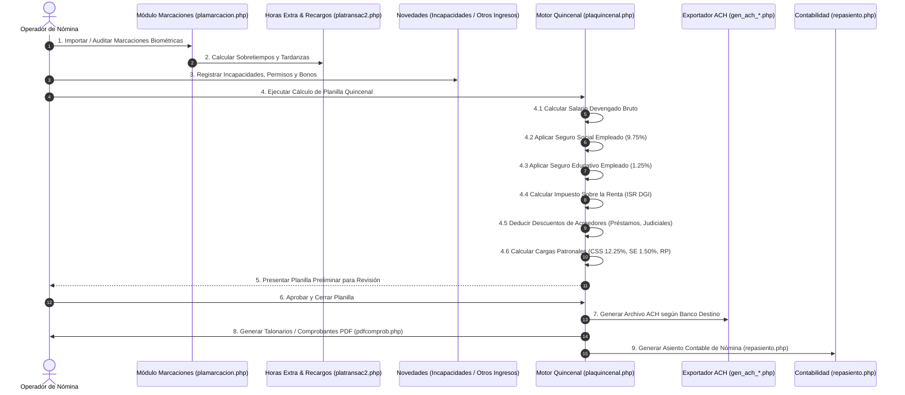

# APP-001: Workflows de Planilla, Prestaciones y Liquidaciones

**Documento:** `04_payroll_and_liquidation_workflows.md`  
**Estado:** `CONFIRMED`  
**Legislación:** Código de Trabajo de la República de Panamá, Leyes de CSS y DGI

---

## 1. Workflow de Procesamiento de Planilla Quincenal (`WF-001`)



### 1.1 Fórmulas Matemáticas y Reglas de Deducciones de Ley en Panamá

1. **Seguro Social Obrero (CSS):**
   $$\text{CSS}_{\text{obrero}} = \text{Salario Bruto Gravable} \times 9.75\%$$

2. **Seguro Educativo Obrero (SE):**
   $$\text{SE}_{\text{obrero}} = \text{Salario Bruto Gravable} \times 1.25\%$$

3. **Cargas Patronales:**
   $$\text{CSS}_{\text{patronal}} = \text{Salario Bruto Gravable} \times 12.25\%$$
   $$\text{SE}_{\text{patronal}} = \text{Salario Bruto Gravable} \times 1.50\%$$
   $$\text{Riesgos Profesionales (RP)} = \text{Salario Bruto} \times \text{Tasa\_RP\_Empresa}\%$$

4. **Impuesto Sobre la Renta (ISR Empleados - DGI Panamá):**
   - Renta Anual Gravable Estimada = $(\text{Salario Mensual} \times 13) - \text{Deducción Cónyuge (\$800)} - (\text{Dependientes} \times \$250) - \text{CSS anual}$.
   - De $\$0.00$ a $\$11,000.00$: **Exento (0%)**.
   - De $\$11,000.01$ a $\$50,000.00$: **15%** sobre el excedente de $\$11,000.00$.
   - Más de $\$50,000.00$: **\$5,850.00 + 25%** sobre el excedente de $\$50,000.00$.
   - Cuota Quincenal de ISR = $\text{ISR Anual Calculado} / 24$.

5. **Gastos de Representación:**
   - No gravan CSS ni SE.
   - Gravan ISR de Gastos de Representación: 10% fijo (o escala especial según tramo).

---

## 2. Workflow de Décimo Tercer Mes (`WF-002`)

- **Marco Legal:** Decreto de Gabinete N° 221 de 1971.
- **Ciclo de 3 Partidas:**
  1. *Primera Partida:* Período del 16 de Diciembre al 15 de Abril (Pago en Abril).
  2. *Segunda Partida:* Período del 16 de Abril al 15 de Agosto (Pago en Agosto).
  3. *Tercera Partida:* Período del 16 de Agosto al 15 de Diciembre (Pago en Diciembre).
- **Fórmula de Cálculo:**
  $$\text{XIII Mes} = \frac{\sum (\text{Salarios Ordinarios, Horas Extra, Comisiones, Bonos del Período})}{12}$$
- **Deducciones:**
  - Descuento Obrero de Seguro Social: **7.25%**.
  - No aplica Seguro Educativo (0.00%).
  - Sujeto a retención de ISR si supera los límites gravables.

---

## 3. Workflow de Liquidaciones Laborales (`WF-004`)

El módulo `plaliquida.php` implementa las causales de despido y terminación contempladas en el Código de Trabajo de Panamá:

```mermaid
graph TD
    INICIO["Cese de Colaborador"] --> CAUSAL{"Causal de Salida"}

    CAUSAL -->|Renuncia| R1["Derechos Adquiridos + Prima de Antigüedad (si es indef.)"]
    CAUSAL -->|Renuncia sin Aviso| R2["Deduce 1 semana de preaviso (Art. 222)"]
    CAUSAL -->|Mutuo Consentimiento| MC["Derechos Adquiridos + Prima + Indemnización pactada"]
    CAUSAL -->|Art. 212 (< 2 años)| MD["Derechos Adquiridos + Preaviso (30 días) + Indemnización Art. 225"]
    CAUSAL -->|Despido Injustificado| DI["Derechos Adquiridos + Preaviso + Indemnización + Salarios Caídos"]
    CAUSAL -->|Despido Justificado Art. 213| DJ["Solo Derechos Adquiridos + Prima de Antigüedad"]
    CAUSAL -->|Vencimiento Contrato| VC["Derechos Adquiridos + Salarios pendientes"]
```

### 3.1 Rubros Componentes de una Liquidación en Panamá

1. **Derechos Adquiridos (Inalienables en cualquier causal):**
   - **Salarios Devengados Pendientes:** Días laborados en la última quincena.
   - **Vacaciones Proporcionales:** 1 día por cada 11 días trabajados no gozados.
   - **Décimo Tercer Mes Proporcional:** Salarios acumulados en la partida activa dividido entre 12.

2. **Prima de Antigüedad (Art. 224 Código de Trabajo):**
   - Aplica a todo contrato indefinido sin importar la causa de terminación.
   - **Cálculo:** 1 semana de salario por cada año laborado de servicio continuo:
     $$\text{Prima} = \frac{\text{Años de Servicio} \times \text{Salario Semanal}}{1} + \text{Proporción meses/días}$$

3. **Indemnización por Despido Injustificado / Art. 212 / Art. 225:**
   - Para contratos indefinidos:
     - Primer año: 3.4 semanas por año.
     - Siguientes años: Escalas progresivas (Ley 44 de 1995: 3.4 semanas/año).
   - Para contratos definidos terminados antes de tiempo (Art. 227): Totalidad de los salarios restantes hasta la fecha de vencimiento.

4. **Preaviso (Art. 212 / Art. 222):**
   - Si el empleador despide sin dar 30 días de preaviso: Pago de **30 días de salario** en la liquidación.
   - Si el trabajador renuncia sin dar 15 días de preaviso: Deducción de **1 semana de salario**.
