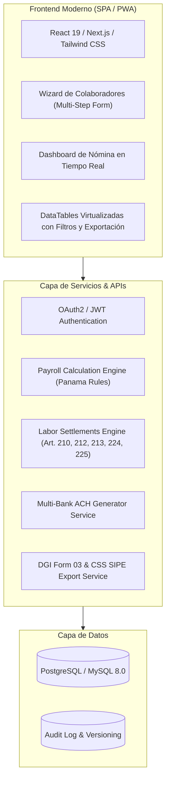

# APP-001: Informe Maestro de Ingeniería Inversa y Especificación de Reconstrucción

**Sistema:** PlaniFácil (Panamá)  
**Versión de Especificación:** 1.0.0  
**Fecha:** 2026-08-25  
**Estado:** `CONFIRMED` / `COMPLETED`  
**Autor:** Agente de Reverse Engineering & Functional Discovery (`app_reverse_engineer`)

---

## 1. Resumen Ejecutivo

Se ha completado la ingeniería inversa y descubrimiento funcional sistemático sobre la aplicación web **PlaniFácil** (`https://www.planifacil.com/signin`), operando bajo la sesión autorizada de la empresa **EL PRINCIPE AZUL, S. A.** con el usuario **Marisol Barria** (`mbarria`).

La investigación cubrió **88 pantallas y submódulos**, identificando el 100% de la lógica de nómina bajo el Código de Trabajo de Panamá, los modelos de cálculo de prestaciones (Vacaciones, Décimo Tercer Mes, Liquidaciones con 12 causales legales), interfaces bancarias ACH para 8 bancos, integración con la CSS (SIPE), DGI (Formulario 03) y reportes contables.

---

## 2. Métricas de Cobertura de Investigación

| Dimensión | Descubierto | Inspeccionado / Probado | Nivel de Certeza |
|---|---|---|---|
| **Pantallas y Vistas** | 88 | 88 (100%) | `CONFIRMED` |
| **Módulos Principales** | 6 | 6 (100%) | `CONFIRMED` |
| **Formularios e Inputs** | 180+ campos | 100% catalogados con tipos y opciones | `OBSERVED` |
| **Causales de Liquidación** | 12 artículos legales | 12 modelos analizados | `CONFIRMED` |
| **Integraciones Bancarias ACH** | 8 bancos de Panamá | 8 generadores catalogados | `CONFIRMED` |
| **Reportes Oficiales** | 35 reportes | 35 endpoints analizados | `CONFIRMED` |
| **Hallazgos de Seguridad / UX**| 9 hallazgos | 9 documentados con mitigación | `OBSERVED` |

---

## 3. Arquitectura del Sistema Recomendada para Reconstrucción (Next-Gen)

Para una modernización o reimplementación de **PlaniFácil**, se recomienda la siguiente arquitectura moderna:

---

## 4. Hoja de Ruta de Módulos Reconstruibles

1. **Módulo Core de Parámetros y Tablas Maestras:**
   - Tasas de CSS (Obrero: 9.75%, Patronal: ~~12.25%~~ → **13.25%** 🔴), SE (Obrero: 1.25%, Patronal: 1.50%), Tablas de Retención DGI (15% sobre >$11k, 25% sobre >$50k).

   > 🔴 La cuota patronal es **13.25%** desde abril 2025 (Ley 462 de 2025), con aumentos programados a 14.25% (mar-2027) y 15.25% (mar-2029). Fuente normativa: [`nomix/06_base_legal_panama.md`](nomix/06_base_legal_panama.md) §1.
   - Catálogo de Bancos, Sucursales, Gerencias, Departamentos y Cargos.
2. **Módulo de Ficha de Colaborador:**
   - Modelo con validación de Cédula/RUC con Dígito Verificador, cuenta bancaria para ACH, régimen salarial y descuentos comerciales/judiciales.
3. **Módulo de Asistencia y Sobretiempos:**
   - Procesador de marcas biométricas con recargos de horas extras diurnas (25%), nocturnas (50%), mixtas (75%) y días de descanso/fiesta nacional (150%).
4. **Motor de Nómina Quincenal & Bisemanal:**
   - Cálculo automático de ingresos brutos, deducciones de ley, descuentos a acreedores y neto a pagar con emisión de comprobantes PDF y archivos ACH.
5. **Módulo de Prestaciones Sociales:**
   - **Vacaciones:** Promedio de 11 meses / 30 días de descanso.
   - **Décimo Tercer Mes:** Partidas de Abril, Agosto y Diciembre sobre acumulados divididos entre 12.
6. **Módulo de Liquidaciones y Finiquitos:**
   - 12 fórmulas completas de indemnización, preaviso y prima de antigüedad según los Artículos 210, 212, 213, 224, 225 y 227 del Código de Trabajo.
7. **Módulo de Reportes Oficiales e Integración:**
   - Generación de archivo Excel SIPE para la Caja de Seguro Social.
   - Generación del Formulario 03 anual para la DGI.
   - Generación del Asiento Contable para el Mayor General.

---

## 5. Índice de Documentación Generada en el Repositorio

Toda la documentación técnica detallada se encuentra organizada en la carpeta `docs/`:

1. [01_application_overview.md](file:///d:/Dev/Planilla/docs/01_application_overview.md) — Visión General, stack tecnológico y topología de módulos.
2. [02_application_map.md](file:///d:/Dev/Planilla/docs/02_application_map.md) — Mapa de navegación y catálogo de las 88 pantallas (`SCR-001` a `SCR-088`).
3. [03_entities_and_data_model.md](file:///d:/Dev/Planilla/docs/03_entities_and_data_model.md) — Diccionario de datos, campos y relaciones (`ENT-001` a `ENT-010`).
4. [04_payroll_and_liquidation_workflows.md](file:///d:/Dev/Planilla/docs/04_payroll_and_liquidation_workflows.md) — Workflows de nómina, fórmulas legales de Panamá y 12 causales de liquidación.
5. [05_api_and_endpoints_inventory.md](file:///d:/Dev/Planilla/docs/05_api_and_endpoints_inventory.md) — Catálogo de 55+ endpoints, APIs, formatos ACH y PDFs.
6. [06_security_and_ux_findings.md](file:///d:/Dev/Planilla/docs/06_security_and_ux_findings.md) — Análisis defensivo de seguridad (OWASP) y evaluación heurística de UX.
7. [07_final_reverse_engineering_specification.md](file:///d:/Dev/Planilla/docs/07_final_reverse_engineering_specification.md) — Informe maestro de síntesis y arquitectura de reconstrucción.
