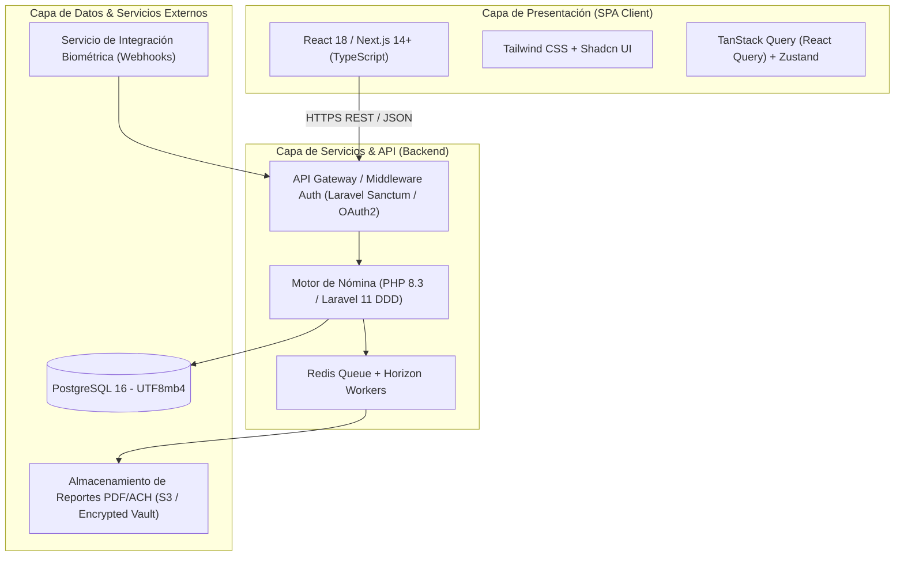
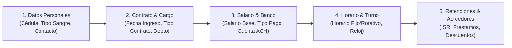
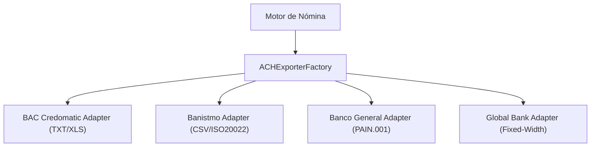
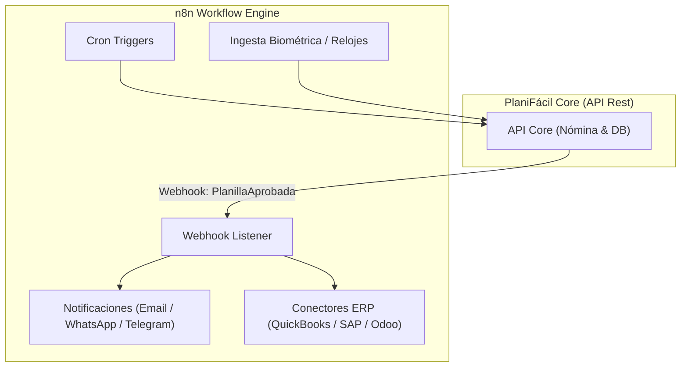
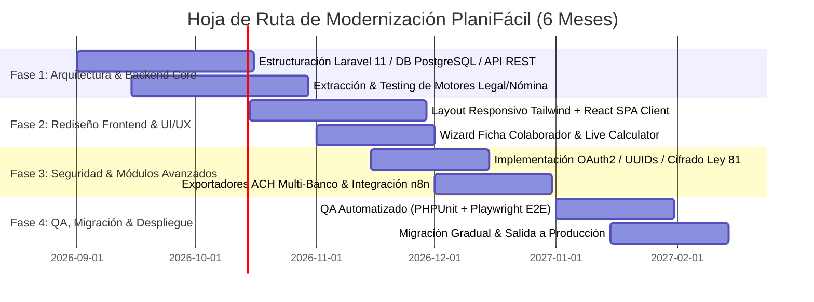

# APP-001: Propuesta Estratégica de Modernización e Ingeniería para PlaniFácil

**Documento:** `propuesta_mejora_planifacil.md`  
**Autor:** Antigravity AI  
**Estado:** `PROPOSED`  
**Referencia Base:** Diagnóstico de Ingeniería Inversa (`01_application_overview.md` - `07_final_reverse_engineering_specification.md`)  
**Jurisdicción Legal:** República de Panamá (Código de Trabajo, DGI, CSS/SIPE, MITRADEL)

---

## Executive Summary

Tras el análisis defensivo y la ingeniería inversa efectuada sobre la plataforma **PlaniFácil** (`APP-001`), se concluye que el sistema posee una **lógica de negocio madura y altamente alineada con la legislación laboral panameña** (manejo de retenciones CSS/DGI, partidas de XIII mes, liquidaciones según Art. 212/213/224/225 y generador ACH multi-banca). Sin embargo, presenta **deuda técnica considerable** en la capa de presentación (layout fijo `1200px` en `<iframe>`, formularios monolíticos de 110+ campos), acoplamiento procesal en PHP legado (`.php` monolíticos), y riesgos de seguridad defensiva (ausencia de anti-CSRF en endpoints internos, IDs secuenciales propensos a IDOR y codificación `iso-8859-1`).

Este documento detalla la propuesta integral de modernización estructurada en 4 pilares estratégicos: **Stack Tecnológico**, **Interfaz y Experiencia de Usuario (UI/UX)**, **Lógica de Negocio y Reglas Panamá**, y **Seguridad Defensiva**.

---

## 1. Pillar 1: Stack Tecnológico y Arquitectura

### 1.1 Estado Actual (`OBSERVED`)
- **Arquitectura:** Monolito PHP procedimental en pila LAMP legado (`plaquincenal.php`, `plaliquida.php`, `placolaborador.php`).
- **Contenedor UI:** HTML en tablas fijas (`1200px`) cargadas dentro de un `<iframe>` (`#ejecucion` de `1400px`).
- **Frontend Client:** jQuery 1.10.2, jQuery UI, jQuery BlockUI.
- **Exportaciones:** FPDF/TCPDF y PHPSpreadsheet síncronos en el hilo HTTP principal.

### 1.2 Arquitectura Propuesta: Headless REST/GraphQL API + Modern SPA Client



### 1.3 Matriz de Decisión y Justificación Técnica

| Componente | Selección Recomendada | Alternativa Considerada | ¿Por qué esta decisión? (Rationale) |
|---|---|---|---|
| **Backend Framework** | **Laravel 11+ / PHP 8.3 (Clean Arch / DDD)** | Node.js (NestJS) | Reutilización de los algoritmos matemáticos y legales existentes en PHP, pero refactorizados bajo arquitectura limpia con Type Hinting, Enums y DTOs estricto. Evita reescribir desde cero la compleja lógica tributaria panameña. |
| **Frontend Framework** | **React 18 (Next.js / Vite) + TypeScript** | Vue 3 / Inertia.js | Elimina definitivamente la dependencia de `<iframe>`. Brinda tipado estricto para evitar errores en campos de nómina y permite renderizado reactivo e instantáneo. |
| **Diseño UI / CSS** | **Tailwind CSS + Shadcn UI / Radix UI** | Bootstrap 5 | Shadcn/Tailwind permite construir interfaces modernas, accesibles, totalmente responsivas (móvil/desktop) y personalizables con baja sobrecarga de bundle CSS. |
| **Base de Datos** | **PostgreSQL 16 (UTF-8)** | MySQL 8.0 | PostgreSQL ofrece un manejo superior de tipos numéricos exactos (`NUMERIC`/`DECIMAL` para cálculos de centavos en planilla), transacciones complejas e indexación JSONB para configuraciones de acreedores. |
| **Tareas Asíncronas** | **Redis + Laravel Horizon** | Procesamiento Síncrono PHP | La generación de lotes ACH multi-banca, reportes SIPE y PDFs de planillas masivas se mueven a colas en segundo plano, liberando el hilo HTTP y eliminando timeouts. |

---

## 2. Pillar 2: Interfaz y Experiencia de Usuario (UI/UX)

### 2.1 Hallazgos Actuales (`UX-001` a `UX-005`)
1. `UX-001`: Ancho fijo de `1200px` destruye la operabilidad en laptops y tabletas.
2. `UX-002`: Contenedor `<iframe>` fuerza doble barra de desplazamiento y pierde URLs navegables.
3. `UX-003`: Formularios monolíticos de 110+ campos (`placolaborador.php`) producen fatiga cognitiva y errores de digitación.
4. `UX-004`: Codificación `iso-8859-1` corrompe caracteres con tildes y eñes.
5. `UX-005`: Uso de `$.blockUI()` genérico congela la pantalla sin feedback progresivo.

### 2.2 Propuesta de Rediseño UI/UX

#### A. Wizard Modular para la Ficha del Colaborador (`placolaborador.php`)
Reorganizar los 110+ campos en un **Stepper / Wizard interactivo de 5 pasos**:



#### B. Layout Responsivo Moderno (Sidebar + Content Workspace)
- Sustituir `#cssmenu` y el `<iframe>` por un layout responsivo estándar con **Sidebar retráctil**, **Header con buscador global (Cmd+K)** y un **Workspace fluido con auto-scroll**.
- Implementar **Live Preview Calculations**: Al ajustar un salario base u horas extras en la pantalla, mostrar un cálculo en tiempo real de los aportes CSS (9.75%), SE (1.25%) e ISR estimado.

#### C. Sistema de Feedback y Notificaciones
- Reemplazar `$.blockUI()` por **Skeleton Loaders** durante la carga de datos y **Sonner / Toast Notifications** para confirmaciones de guardado.
- Para operaciones extensas (ej. Cálculo Quincenal o Exportación ACH), mostrar un **Progress Bar modal** impulsado por WebSockets / Server-Sent Events (SSE).

---

## 3. Pillar 3: Lógica de Negocio y Reglas Panamá

### 3.1 Hallazgos de Lógica Actual (`WF-001` a `WF-004`)
- Los cálculos de Seguro Social (9.75% / **13.25%** 🔴), Seguro Educativo (1.25% / 1.50%), ISR DGI (tabla progresiva anual / 24 quincenas), XIII Mes (3 partidas) y Liquidaciones (Art. 212, 213, 224, 225) están **mezclados con código HTML/SQL** en archivos procedimentales.

> 🔴 **La cuota patronal de CSS es 13.25%**, no 12.25%, desde abril de 2025 (Ley 462 de 18 de marzo de 2025). Escalona a 14.25% en marzo 2027 y a 15.25% en marzo 2029.
>
> Esos tres cambios ya programados son la justificación definitiva de que **ninguna tasa puede ser una constante en el código**: deben resolverse por fecha de vigencia del período que se calcula. Ver [`08_decisiones_arquitectura.md`](08_decisiones_arquitectura.md) `ADR-001`.

### 3.2 Estrategia de Modernización de Lógica

#### A. Patrón Domain Service & Calculation Engine (Pure Functions)
Aislar las fórmulas de nómina en **Clases puras desacopladas de la base de datos y la vista**, permitiendo Pruebas Unitarias automatizadas (`100% Code Coverage`):

```php
// Ejemplo de interfaz de Dominio para Panamá
interface PanamaTaxCalculatorInterface {
    public function calculateCSS(float $grossSalary): DeductionResult;
    public function calculateSE(float $grossSalary): DeductionResult;
    public function calculateISR(float $annualEstimatedIncome, int $dependents, bool $hasSpouse): DeductionResult;
    public function calculateLiquidation(Colaborador $colaborador, CausalSalida $causal, DateTime $fechaCese): LiquidationResult;
}
```

#### B. Patrón Strategy para Generación de Archivos ACH Multi-Banco
En lugar de scripts aislados (`xls_ach_bac.php`, `gen_ach_banistmo.php`), implementar una estrategia unificada con adaptadores por entidad financiera:



#### C. Motor de Reglas de Sobretiempo y Convenios Colectivos
- Implementar un motor de reglas parametrizable para recargos de horas extras según el Código de Trabajo de Panamá:
  - **Diurna (+25%)**
  - **Nocturna (+50%)**
  - **Mixta (+50% o +75%)**
  - **Día de Fiesta / Duelo Nacional (+150%)**
  - **Horas Excedentes en Día de Fiesta (+150% + 50%)**
- Permitir configuraciones personalizadas por empresa para recargos superiores a los de ley (Convenios Colectivos).

> ### 🔴 Corrección verificada (Art. 33, 48 y 49 CT)
>
> Ver [`06_base_legal_panama.md`](06_base_legal_panama.md) §5.
>
> **1. El recargo no depende del tipo de jornada del trabajador, sino de qué jornada se prolonga.** Presentarlo como *"Mixta (+50% o +75%)"* es incorrecto: la indecisión no es de la norma, es de qué se está prolongando.
>
> | Situación | Recargo |
> |---|---|
> | Hora extra en jornada **diurna** | **+25%** |
> | Hora extra en jornada **nocturna**, o prolongación de **mixta iniciada de día** | **+50%** |
> | Hora extra que **prolonga la jornada nocturna**, o **mixta iniciada de noche** | **+75%** |
>
> El motor debe evaluar el **momento de inicio de la jornada**, no leer una etiqueta de la ficha del colaborador.
>
> **2. Falta el recargo de domingo / día de descanso semanal: +50%** (Art. 48).
>
> **3. La regla *"+150% + 50%"* es incorrecta.** El Art. 49 establece que *"el recargo del 150 por ciento **incluye** la remuneración del día de descanso"*. No se paga el día ordinario más un 150% adicional. El +50% adicional aplica únicamente cuando el trabajador labora en el **día compensatorio** que se le otorgó.
>
> **4. Rangos horarios** (faltaban por completo, y sin ellos no se puede clasificar una hora extra):
> diurna 6:00–18:00 (8h/48sem) · nocturna 18:00–6:00 (7h/42sem) · mixta máx. 3h nocturnas (7.5h/45sem).
>
> **5. Límite legal:** 3 horas diarias / 9 horas semanales (Art. 36).

---

## 4. Pillar 4: Seguridad Defensiva y Protección de Datos

### 4.1 Matriz de Hallazgos y Soluciones Defensivas

| ID | Hallazgo Observado (`FIND-xxx`) | Severidad | Solución Defensiva Propuesta | Impacto de la Mejora |
|---|---|---|---|---|
| `FIND-001` | Formularios sin token Anti-CSRF en `app.planifacil.com/empresas/` | **Medium** | Inyección de Middleware Anti-CSRF obligatorio (`X-CSRF-TOKEN`) en todas las peticiones POST/PUT/DELETE. | Previene ataques de falsificación de peticiones en acciones críticas como modificar cuentas ACH o aprobar planillas. |
| `FIND-002` | Faltan cabeceras HTTP de seguridad (CSP, HSTS, X-Frame-Options) | **Low** | Configuración estricta de NGINX/Cloudflare: `Strict-Transport-Security: max-age=31536000`, `X-Frame-Options: DENY`, `Content-Security-Policy`. | Evita ataques de Clickjacking, man-in-the-middle y ejecuciones de scripts no autorizados (XSS). |
| `FIND-003` | Atributos de Cookie de Sesión inseguros (`Secure`, `HttpOnly`) | **Low** | Forzar `session.cookie_secure = true`, `session.cookie_httponly = true`, `SameSite = Strict`. | Protege las galletas de sesión de ser interceptadas en redes Wi-Fi no cifradas o leídas vía JavaScript malicioso. |
| `FIND-004` | Identificadores secuenciales expuestos (`id2`, `id_empresa`) propensos a IDOR | **Medium** | 1. Reemplazar IDs enteros por **UUIDv4** o **Hashids**.<br/>2. Imponer `TenantScope Middleware` (Global Scope por `id_empresa` de la sesión). | Garantiza que un usuario de la Empresa A no pueda consultar ni modificar colaboradores de la Empresa B alterando la URL. |
| **NUEVO** | Datos sensibles de colaboradores almacenados en texto plano | **High** | Cifrado a nivel de aplicación (AES-256-GCM) para campos PII: Cédula, Número de Cuenta Bancaria y Salario Base. | Cumplimiento estricto con la Ley 81 de Protección de Datos Personales de la República de Panamá. |
| **NUEVO** | Ausencia de Trail de Auditoría inmutable | **Medium** | Implementar `AuditLogService` que registre: Usuario, Fecha/Hora, IP, Acción, Valor Anterior, Valor Nuevo. | Permite auditorías forenses exigidas por firmas contables y autoridades fiscales (DGI/MITRADEL). |

## 5. Integración de n8n: Automatización de Workflows y Conectividad Externa

**n8n** (plataforma open-source de orquestación y automatización de flujos de trabajo) tiene un **lugar estratégico y de altísimo valor** en el ecosistema de **PlaniFácil**, actuando como el **motor de integración asíncrono y notificaciones**.



### 5.1 Casos de Uso Concretos para n8n en PlaniFácil

1. **Envío Masivo de Comprobantes de Pago (Talonarios) y Notificaciones:**
   - **Flujo:** Al aprobar una planilla quincenal, la API emite un evento Webhook a n8n.
   - **Acción n8n:** n8n descarga los PDFs de comprobantes de pago de forma asíncrona y los distribuye a cada colaborador por correo electrónico (SMTP/Resend) y WhatsApp, liberando al servidor principal de enviar cientos de correos síncronos.

2. **Ingesta e Integración con Relojes Marcadores Biométricos:**
   - **Flujo:** Relojes de control de asistencia (ZKTeco, Hikvision, Anviz) o servicios en la nube (Toggl, Clockify, Google Sheets).
   - **Acción n8n:** n8n realiza llamadas periódicas o recibe webhooks de los relojes en sucursales, transforma las marcaciones (Cédula, Hora Entrada/Salida) al formato estándar de PlaniFácil y las inyecta en la API `/api/v1/marcaciones`.

3. **Alertas de Cumplimiento Legal y RRHH (Cron Workflows):**
   - **Vencimiento de Contratos:** Tarea programada diaria en n8n que consulta contratos definidos que vencen en los próximos 15 a 30 días y notifica al departamento de RRHH por Slack/WhatsApp.
   - **Recordatorio de Vencimientos Fiscales:** Notificaciones 3 días antes de la fecha límite de presentación del SIPE (CSS) y Formulario 03 (DGI).
   - **Acumulación Excesiva de Vacaciones:** Alertas sobre colaboradores con más de 30 días de vacaciones no gozadas.

4. **Integración B2B con ERPs y Contabilidad de Clientes:**
   - **Flujo:** Generación del asiento contable de nómina (`repasiento.php`).
   - **Acción n8n:** n8n recibe el payload JSON del asiento contable y lo transforma para enviarlo automáticamente a APIs de sistemas contables como **QuickBooks Online, SAP Business One, Odoo, Zoho Books o Xero**.

### 5.2 Regla de Frontera: ¿Qué NO debe hacer n8n?
- ❌ **No calcular impuestos, neto ni prestaciones:** Los cálculos matemáticos del Seguro Social, Seguro Educativo, ISR y Liquidaciones **DEBEN** ser ejecutados de forma determinista y estricta en el Backend Core de PlaniFácil (Laravel/NestJS).
- ❌ **No reemplazar la base de datos principal:** n8n no almacena el estado maestro de los colaboradores, solo orquesta mensajes y payloads en tránsito.

---

## 6. Plan de Ejecución Continuo y Hoja de Ruta (Roadmap)



---

## 7. Conclusión y Recomendación Final

La modernización propuesta para **PlaniFácil** no requiere reescribir la valiosa inteligencia de negocios ni las reglas fiscales panameñas que la plataforma ya resuelve correctamente. En su lugar, el plan se enfoca en **desacoplar el frontend del backend**, eliminar la fragilidad del contenedor `<iframe>`, elevar la experiencia de usuario a estándares modernos responsivos y cerrar las brechas de seguridad defensiva y privacidad de datos (Ley 81 de Panamá). La inclusión de **n8n** completa la solución al encargarse del envío masivo de comprobantes, alertas automáticas de RRHH y conectividad B2B con sistemas contables externos.

