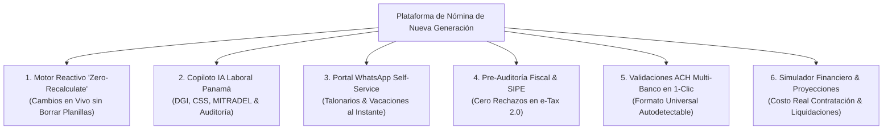

# Visión de Producto: Nomix - Nómina Inteligente

**Documento:** `vision_producto_factor_wow.md`  
**Nombre del Proyecto:** **Nomix**  
**Tagline:** *Nómina inteligente*  
**Objetivo:** Definir la arquitectura de producto, características disruptivas y propuesta de valor única (UVP) para **Nomix**, la plataforma de nómina de nueva generación diseñada para dominar el mercado en Panamá y la región.

---

## 1. El Problema del Mercado Actual en Panamá (`OBSERVED`)

Las soluciones tradicionales de planilla en Panamá (PlaniFácil, software en Excel o sistemas contables legados) sufren de:
1. **Trabajo manual repetitivo y reprocesos:** Modificar un dato implica borrar la planilla y volver a generarla desde cero.
2. **Temor a multas legales/fiscales:** Miedo a cálculos erróneos en SIPE (CSS), DGI (Formulario 03) o despidos en MITRADEL.
3. **Ficción operativa en RRHH:** El personal de planilla pasa el 40% de su tiempo respondiendo solicitudes de empleados (*"mándame mi talonario"*, *"¿cuánto me viene de décimo?"*).
4. **Interfaces anticuadas e insensibles al contexto:** Experiencias de usuario de los años 2000, no aptas para teléfonos móviles ni ejecutivos modernos.

---

## 2. Los 6 Diferenciadores "Factor WOW"

---

### 🌟 1. Motor Reactivo "Zero-Recalculate" (Cálculo en Vivo en Tiempo Real)
- **El WOW:** Eliminar para siempre el botón "Generar Planilla" y el flujo frustrante de "Borrar y Volver a Hacer".
- **Cómo funciona:** La planilla es una hoja de cálculo reactiva e inteligente en tiempo real. Si el usuario edita una tardanza, salario base u hora extra, el sistema actualiza de inmediato el salario neto y las deducciones con un **diff visual resaltado en verde/azul** que muestra exactamente qué cambió:  
  * Ejemplo: `Carlos Pérez: Salario Bruto +$25.00 (2 hrs extras) | CSS +$2.44 | Neto +$22.56`.
- **Por qué gana al mercado:** Resuelve directamente el mayor dolor del usuario actual (*"tuve que eliminar la planilla y volverla a hacer porque los datos no los hala"*).

---

### 🤖 2. Copiloto IA Laboral Panamá (Asistente Legal & Auditor de Nómina)
- **El WOW:** Tener un abogado laboralista y un auditor fiscal integrado dentro de la plataforma 24/7.
- **Casos de uso:**
  1. **Generador de Liquidaciones y Cartas de Despido:** El usuario selecciona la causal (ej. Art. 212 o Mutuo Consentimiento) y el Copiloto IA no solo calcula exactamente la Prima de Antigüedad, Vacaciones, XIII Mes y Preaviso, sino que redacta la **Carta de Terminación de Contrato oficial para MITRADEL** en PDF lista para firmar.
  2. **Detector de Anomalías en Nómina:** Antes de cerrar la quincena, la IA audita los datos y alerta:  
     *`⚠️ Atención: El colaborador José Rodríguez refleja 45 horas extras en esta quincena (+150% del promedio histórico). ¿Deseas auditar las marcaciones antes de aprobar?`*
- **Por qué gana al mercado:** Transforma el software de un simple calculador a una herramienta de protección legal y financiera para la empresa.

---

### 📱 3. Portal Conversacional en WhatsApp para Colaboradores (Self-Service)
- **El WOW:** El 95%+ de la fuerza laboral en Panamá utiliza WhatsApp diariamente. En lugar de obligar a los empleados a descargar una app o entrar a un portal web con clave que olvidan, **todo se resuelve por WhatsApp**.
- **Flujo de Usuario:**
  - El empleado escribe al WhatsApp verificado de la empresa: *"Mi comprobante de hoy"* o *"¿Cuántos días de vacaciones me quedan?"*.
  - El sistema autentica su identidad vía OTP/SMS.
  - El bot le entrega al instante su **Talonario de Pago en PDF** o su estado de vacaciones.
- **Por qué gana al mercado:** Elimina hasta un 80% de las solicitudes repetitivas a RRHH y genera un impacto masivo de satisfacción en los empleados.

---

### 🏥 4. Pre-Auditoría Fiscal e Ingestion SIPE / DGI en 1-Clic
- **El WOW:** Garantía de "Cero Errores / Cero Rechazos" al subir archivos a e-Tax 2.0 (DGI Formulario 03) o al portal SIPE de la Caja de Seguro Social.
- **Cómo funciona:** La plataforma corre una validación previa de 30+ reglas fiscales:
  - Verificación de RUC / DV y Cédulas panameñas (algoritmo de validación de cédulas por provincia/tomo/asiento).
  - Comprobación de topes y tramos de ISR.
  - Generación directa del archivo TXT/CSV formateado al 100% como exige la CSS sin necesidad de conversores externos.

---

### 🏦 5. Validaciones ACH Multi-Banco Inteligente
- **El WOW:** Soporte universal autodetectable para **BAC Credomatic, Banistmo, Banco General, Global Bank, Multibank, St. Georges Bank, etc.**
- **Diferenciador:** Valida la estructura de la cuenta bancaria (longitud, tipo de cuenta) *antes* de descargar el archivo, evitando rechazos vergonzosos en las bancas en línea de los bancos al momento de pagar la nómina.

---

### 📊 6. Simulador Financiero de Contratación y Escenarios de Salida
- **El WOW:** Herramienta visual e interactiva para Gerentes Generales, CFOs y Directores de RRHH.
- **Escenario 1 (Contratación):** *"Si quiero contratar a un Ingeniero con salario neto de $2,000, ¿cuál es el costo real total mensual para la empresa contando cargas patronales (CSS **13.25%** 🔴, SE 1.50%, RP según CIIU, Reserva XIII Mes 8.33%, Reserva Vacaciones 9.09%, Prima de Antigüedad 1.92%, Cuota de Cesantía 5%)?"* -> El sistema da el costo empresarial exacto en segundos.

> 🔴 **Cifras actualizadas.** La cuota patronal de CSS es **13.25%** (Ley 462 de 2025), no 12.25%. La tasa de Riesgos Profesionales **no es fija en 1.50%**: va de 0.56% a 6.25% según la actividad CIIU de la empresa. Y faltaban dos componentes de costo real: la provisión de **prima de antigüedad (1.92%)** y la **cuota de indemnización del Fondo de Cesantía (5%)**.
>
> El monto ilustrativo de $2,642.50 se retiró por estar calculado con las tasas anteriores. Ver [`06_base_legal_panama.md`](06_base_legal_panama.md) §1 y §8.
>
> **Nota de producto:** que el simulador acierte el costo patronal real —con la tasa de RP correcta de *esa* empresa y las provisiones completas— es precisamente lo que lo hace vendible a un CFO. Con tasas genéricas es una calculadora más.
- **Escenario 2 (Liquidación Comparativa):** Compara el costo de terminación por Mutuo Consentimiento vs. Despido con Preaviso en un gráfico visual interactivo.

---

## 3. Experiencia UI/UX "Keyboard-First" y Ultrarrápida

- **Buscador Universal (Cmd + K / Ctrl + K):** Permite saltar a cualquier colaborador, reporte o planilla escribiendo 2 letras (estilo Slack/Linear/Stripe).
- **Modo Oscuro / Claro Nivel Enterprise:** Diseño limpio, moderno, con componentes responsivos que se adaptan a teléfonos móviles de supervisores de campo (ej. obras de construcción o restaurantes) para aprobar marcaciones.
- **Transparencia en Fórmulas:** Al hacer clic sobre el monto de ISR o CSS de cualquier colaborador, se despliega una pequeña ventana matemática (*Inspection Drawer*) mostrando paso a paso cómo se calculó la retención.

---

## 4. Estrategia de Posicionamiento en el Mercado

| Dimensión | Software Tradicional (PlaniFácil, Excel, etc.) | Nuestra Nueva Plataforma |
|---|---|---|
| **Velocidad de Operación** | Lenta, requiere eliminar y recalcular todo | **Instantánea / Reactiva en vivo** |
| **Atención a Empleados** | Correos, llamadas y hojas impresas | **WhatsApp Bot Self-Service 24/7** |
| **Soporte Legal** | Ninguno (el usuario responde por errores) | **Copiloto IA Laboral Panamá** |
| **Interfaces** | Tablas fijas de 1200px con iframes | **UX Moderna, Responsiva, Cmd+K** |
| **Integraciones** | Ninguna o exportaciones rígidas | **n8n + APIs REST con QuickBooks/SAP/Odoo** |
