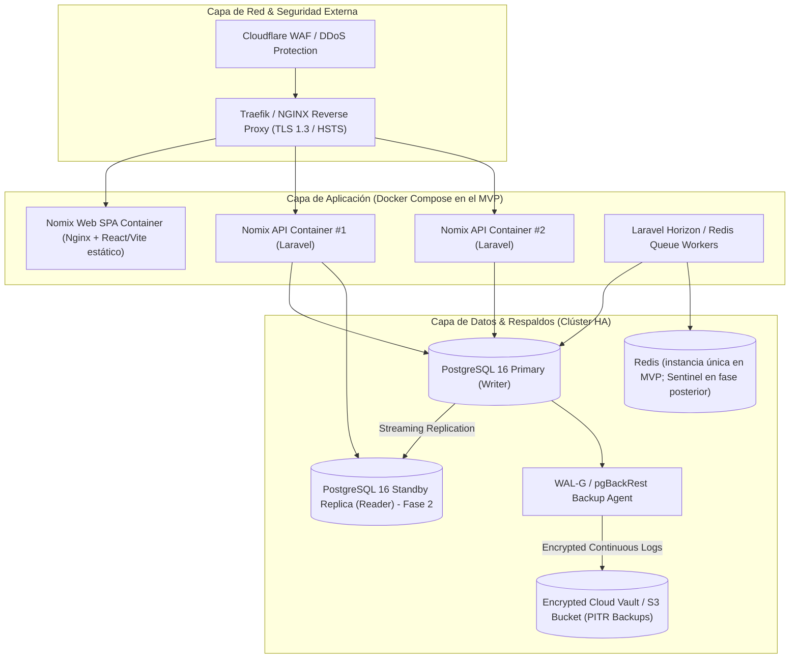

# Especificación Técnica: Arquitectura de Seguridad, Respaldos y Despliegue Docker para Nomix

**Documento:** `arquitectura_docker_seguridad_nomix.md`  
**Proyecto:** **Nomix - Nómina inteligente**  
**Estado:** `ACCEPTED` (ver [00_decisiones_stack_nomix.md](00_decisiones_stack_nomix.md))  

---

## 1. Arquitectura de Despliegue con Docker & Contenedores

### 1.1 Diagrama de Topología en Contenedores



---

## 2. Análisis Crítico: "Por qué SÍ" y "Por qué NO" (Evaluación de Infraestructura)

| Pilar | Decisión Sugerida | ¿Por qué SÍ? (Ventajas) | ¿Por qué CUIDADO / NO? (Riesgos a evitar) |
|---|---|---|---|
| **Dockerización 100% (Containers)** | **SÍ (Desde el día 1)** | • Paridad total entre Dev, Staging y Producción.<br/>• Despliegues *Zero-Downtime* mediante *Rolling Updates*.<br/>• Facilidad para actualizar parches de seguridad de PHP/PostgreSQL reconstruyendo imágenes etiquetadas. | Avoid: No guardar estado ni subir archivos locales dentro de los contenedores (usar S3/Volumes montados). |
| **Seguridad de Datos & Cifrado PII** | **SÍ (Obligatorio - Ley 81 Panamá)** | • Cifrado de campos sensibles (Cédulas, Cuentas ACH, Salarios) con **AES-256-GCM** en aplicación.<br/>• *Row-Level Security (RLS)* en PostgreSQL para aislamiento total multi-inquilino.<br/>• Audit trail inmutable. | Avoid: No confiar únicamente en la seguridad de red; aplicar el principio de *Zero Trust* a nivel de API. |
| **Respaldos Continuos (PITR)** | **SÍ (Esencial en Finanzas)** | • Permite restaurar la DB al segundo exacto antes de un fallo o desastre (*Point-in-Time Recovery*).<br/>• Exportación de WALs cifrados en tiempo real hacia S3 distante. | Avoid: Los dumps sencillos (`pg_dump`) 1 vez al día no bastan para nómina; se pierden datos del día activo. |
| **Clúster de DB (Primary / Replica)** | **MVP: Primary con PITR. Réplica de lectura en Fase 2** | • Lecturas pesadas (reportes, PDFs, exportaciones ACH) se delegan al Read-Replica.<br/>• Failover rápido si el primario falla. | Avoid: Evitar clústeres Multi-Master hiper-complejos (ej. CockroachDB) en el MVP; añaden latencia de consenso innecesaria. |

---

## 3. Plan de Seguridad de Datos & Cumplimiento (Data Protection Strategy)

### 3.1 Cifrado a Nivel de Aplicación (Field-Level Encryption)
Los datos de alta sensibilidad se cifran antes de ser insertados en la base de datos usando una clave maestra administrada en un KMS gestionado (**AWS KMS**):
- `colaboradores.cedula` $\rightarrow$ Encrypted Blob
- `colaboradores.numero_cuenta_ach` $\rightarrow$ Encrypted Blob
- `colaboradores.salario_base` $\rightarrow$ Encrypted Decimal

Los campos cifrados no se pueden filtrar ni ordenar en SQL. Para buscar por cédula se guarda además un **blind index** (hash con clave, p. ej. HMAC-SHA256) en una columna separada.

### 3.2 Aislamiento Multi-Inquilino (Multi-Tenant Isolation)
Uso de **PostgreSQL Row-Level Security (RLS)** para forzar que cada consulta SQL esté acotada al `tenant_id` del usuario autenticado:

```sql
-- Política de Seguridad RLS en PostgreSQL
ALTER TABLE colaboradores ENABLE ROW LEVEL SECURITY;

CREATE POLICY tenant_isolation_policy ON colaboradores
    USING (empresa_id = current_setting('app.current_empresa_id')::uuid);
```

---

## 4. Estrategia de Respaldos y Recuperación ante Desastres (DRP)

1. **Point-in-Time Recovery (PITR):**
   - Transmisión continua de archivos WAL (*Write-Ahead Logging*) hacia un bucket S3 cifrado en tiempo real.
   - **RPO (Recovery Point Objective):** < 5 segundos de pérdida de datos en el peor escenario de desastre.
   - **RTO (Recovery Time Objective):** < 15 minutos para levantar una nueva instancia replicada.
2. **Pruebas Automatizadas de Restauración:**
   - Un contenedor semanal ejecuta la restauración del backup en un entorno aislado para auditar la integridad del respaldo.
