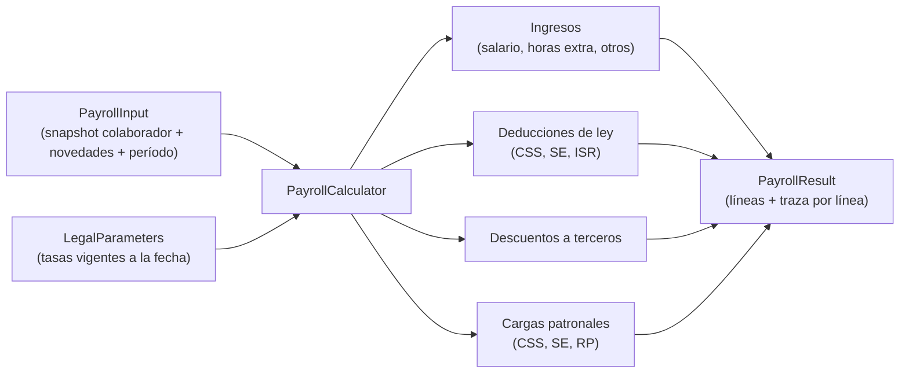

# Arquitectura de Código y Convenciones: Nomix

**Documento:** `05_arquitectura_codigo_y_convenciones.md`  
**Proyecto:** **Nomix - Nómina inteligente**  
**Estado:** `ACCEPTED`  
**Depende de:** [00_decisiones_stack_nomix.md](00_decisiones_stack_nomix.md)

---

## 1. Estructura del Repositorio (monorepo)

```
nomix/
├── AGENTS.md                 # Reglas para agentes (Claude y Codex)
├── CLAUDE.md                 # Importa AGENTS.md
├── README.md
├── Makefile                  # Atajos: make up, make test, make lint...
├── docker-compose.yml        # Entorno de desarrollo
├── .env.example
├── .github/
│   ├── workflows/ci.yml
│   └── pull_request_template.md
├── docker/
│   ├── php/Dockerfile        # PHP-FPM + extensiones (pgsql, redis, bcmath, intl, gd, zip)
│   ├── nginx/default.conf
│   └── postgres/init/        # Roles de BD (app sin BYPASSRLS) y extensiones
├── backend/                  # Laravel
├── frontend/                 # React + Vite
└── docs/
```

### 1.1 Versiones
- **PHP:** 8.3 o superior. **Laravel:** 11 o superior. El día del scaffolding se instala la versión estable más reciente de cada uno que sea compatible entre sí, y se fija en `composer.json` y en `docker/php/Dockerfile`.
- **Node:** LTS vigente. Se fija en `frontend/.nvmrc` y en `package.json` (`engines`).
- **PostgreSQL:** 16. **Redis:** 7.

---

## 2. Backend (Laravel)

### 2.1 Organización por módulos de dominio

```
backend/app/
├── Domain/                         # Lógica pura: sin Eloquent, sin HTTP, sin facades
│   ├── Shared/
│   │   ├── Money/Money.php         # Value object sobre brick/math
│   │   ├── Period/PayPeriod.php    # Quincena, bisemana, mes
│   │   └── Rules/RuleTrace.php     # Traza de cálculo
│   ├── Payroll/
│   │   ├── Calculator/             # PayrollCalculator y un calculador por concepto
│   │   ├── Rules/                  # Una clase por RULE-xxx (CssEmployeeRule, IsrWithholdingStrategy...)
│   │   ├── Input/                  # DTOs de entrada (snapshot del colaborador, novedades)
│   │   └── Result/                 # PayrollResult, LineItem
│   ├── ThirteenthMonth/
│   ├── Vacations/
│   └── Termination/                # Liquidaciones
├── Application/                    # Casos de uso: orquestan dominio + persistencia
│   ├── Payroll/CreatePayrollRun.php, RecalculateEmployee.php, ApprovePayrollRun.php
│   └── Employees/...
├── Infrastructure/
│   ├── Persistence/                # Modelos Eloquent y repositorios
│   ├── Encryption/                 # Cifrado de campos y blind index
│   ├── Exports/                    # ACH (un adaptador por banco), SIPE, PDF
│   └── Tenancy/                    # Middleware de tenant + RLS
└── Http/
    ├── Controllers/Api/V1/
    ├── Requests/                   # Validación (FormRequest)
    └── Resources/                  # Respuesta JSON (API Resources)
```

**Regla de dependencias:** `Http → Application → Domain` e `Infrastructure → Domain`. `Domain` no depende de nada de Laravel. Se verifica con una prueba de arquitectura (Pest `arch()`).

### 2.2 Motor de nómina



Principios:
1. **Función pura:** el mismo `PayrollInput` con los mismos `LegalParameters` siempre produce el mismo `PayrollResult`. Sin fechas del sistema, sin consultas a BD dentro del dominio.
2. **Parámetros por fecha:** `LegalParameters::forDate($fecha)` carga las tasas vigentes (RULE-002 cambia en 2027 y 2029).
3. **Traza por línea:** cada `LineItem` incluye `rule_id`, fórmula legible, entradas y resultado. Alimenta el *Inspection Drawer* del frontend.
4. **Recalcular por colaborador:** el caso de uso `RecalculateEmployee` recalcula solo al colaborador modificado dentro de una planilla en borrador. Es la base del "Zero-Recalculate" de la visión de producto.
5. **Planillas aprobadas son inmutables.** Las correcciones se hacen con una planilla de ajuste.

### 2.3 Dinero
- Clase `Money` propia sobre `brick/math` (`BigDecimal`). Moneda única: USD/Balboa.
- Prohibido `float` en dominio y persistencia. En BD: `NUMERIC(14,2)` para montos y `NUMERIC(9,6)` para tasas.
- Redondeo centralizado en `Money::round()` según RULE-080.
- Una regla de PHPStan o prueba de arquitectura impide usar `float` en `app/Domain`.

### 2.4 Multi-inquilino (empresa)
- Toda tabla de negocio tiene `empresa_id` (UUID).
- Middleware `SetTenantContext`: resuelve la empresa activa del usuario y ejecuta `SET LOCAL app.current_empresa_id = '<uuid>'` dentro de la transacción de la petición.
- La aplicación se conecta con un rol de PostgreSQL **sin** `BYPASSRLS`. Las migraciones usan un rol distinto.
- Además del RLS, un Global Scope de Eloquent filtra por `empresa_id` (defensa en profundidad).
- Prueba obligatoria: un usuario de la empresa A no puede leer ni modificar datos de la empresa B, ni por API ni por consulta directa.

### 2.5 Cifrado de campos sensibles
- Campos: `cedula`, `numero_cuenta`, `salario_base` (ver [06_modelo_datos_mvp.md](06_modelo_datos_mvp.md)).
- **Cifrado envolvente (*envelope*):** una clave de datos por empresa, cifrada con la clave maestra del KMS. En desarrollo, la clave maestra es local (`.env`).
- AES-256-GCM vía un *cast* de Eloquent propio (`EncryptedField`).
- **Blind index** para búsquedas exactas (cédula): `HMAC-SHA256(clave_indice, valor_normalizado)` en una columna `cedula_bidx`.

### 2.6 API
- REST JSON bajo `/api/v1/`. Recursos en plural y en español, igual que el dominio (`/colaboradores`, `/planillas`).
- IDs públicos: UUID. Nunca IDs secuenciales.
- Errores con formato RFC 9457 (*Problem Details*).
- Montos en JSON como **string** con 2 decimales (`"1234.56"`), nunca como número.
- Paginación por cursor en listados grandes.
- Contrato documentado con OpenAPI (generado con Scramble o similar) y publicado en `/docs/api` en desarrollo.

### 2.7 Autenticación y autorización
- Laravel Sanctum en modo SPA (cookie de sesión + CSRF). Mismo dominio padre para SPA y API.
- 2FA con TOTP (Laravel Fortify) obligatorio para roles con acceso a salarios.
- Roles por empresa (un usuario puede trabajar en varias empresas): `admin`, `operador_planilla`, `consulta`. Autorización con Policies.

### 2.8 Auditoría
- Tabla `audit_logs` de solo inserción: usuario, empresa, acción, entidad, valores anteriores y nuevos (con campos cifrados enmascarados), IP, fecha.
- El rol de BD de la aplicación no tiene permisos de `UPDATE` ni `DELETE` sobre `audit_logs`.

### 2.9 Colas
- Redis + Horizon. Trabajos: generar PDFs de comprobantes, archivos ACH y SIPE, envío de correos.
- Todo trabajo debe ser idempotente y reintentable.

---

## 3. Frontend (React + Vite)

```
frontend/src/
├── app/            # Router, providers, layout (sidebar + header + Cmd+K)
├── features/       # Un directorio por módulo: colaboradores, planillas, empresas...
│   └── planillas/
│       ├── api.ts          # Hooks de TanStack Query
│       ├── components/
│       └── pages/
├── components/ui/  # Componentes shadcn/ui
├── lib/            # Cliente HTTP, formateo de dinero y fechas
└── types/          # Tipos generados desde OpenAPI
```

- **Tipos de la API:** se generan desde el OpenAPI del backend (`openapi-typescript`). No se escriben a mano.
- **Formularios:** React Hook Form + Zod.
- **Dinero en el frontend:** se muestra, no se calcula. Los montos llegan como string y se formatean.
- **Routing:** React Router.
- **Pruebas:** Vitest + Testing Library; E2E con Playwright.

---

## 4. Calidad y Pruebas

| Herramienta | Uso | Umbral |
|---|---|---|
| Laravel Pint | Formato PHP | Sin diferencias |
| PHPStan + Larastan | Análisis estático | Nivel máximo en `app/Domain`; nivel 8 o superior en el resto |
| Pest | Pruebas unitarias, de integración y de arquitectura | `app/Domain`: 100% de líneas; pruebas de mutación (Pest Mutate, `composer mutate`) con 100% en el dominio |
| ESLint + Prettier | Frontend | Sin errores |
| TypeScript | `strict: true` | Sin errores |
| Vitest | Pruebas de frontend | Componentes críticos |
| Playwright | Flujos E2E | Flujo de planilla completo |

**Pruebas legales:** cada `RULE-xxx` tiene un archivo de pruebas con los casos del catálogo, en `backend/tests/Legal/RuleXxxTest.php`.

---

## 5. Entorno de Desarrollo (Docker Compose)

| Servicio | Imagen / build | Puerto local |
|---|---|---|
| `nginx` | `docker/nginx` | 8080 |
| `app` | `docker/php` (PHP-FPM) | — |
| `horizon` | misma imagen que `app` | — |
| `frontend` | Node LTS (`vite dev`) | 5173 |
| `postgres` | `postgres:16` | 5432 |
| `redis` | `redis:7` | 6379 |
| `mailpit` | `axllent/mailpit` | 8025 |

Comandos (`Makefile`):
- `make up` / `make down`: levantar y detener.
- `make setup`: instalar dependencias, migrar y cargar datos de prueba.
- `make test`: todas las pruebas de backend y frontend.
- `make lint`: Pint, PHPStan, ESLint, `tsc`.

---

## 6. Integración Continua (GitHub Actions)

En cada PR y en `main`:
1. Lint y formato (backend y frontend).
2. PHPStan.
3. Pest con PostgreSQL 16 real (no SQLite: se necesita RLS).
4. Typecheck y Vitest del frontend.
5. Build del frontend.
6. Playwright (a partir del Hito 3).

Un PR no se fusiona con CI en rojo.

---

## 7. Convenciones

### 7.1 Idioma
- **Dominio de negocio en español:** tablas, columnas, rutas de la API y términos legales (`colaboradores`, `planillas`, `salario_base`, `decimo_tercer_mes`).
- **Código técnico en inglés:** clases, métodos y variables genéricas (`PayrollCalculator`, `calculate()`).
- Cuando una clase representa un concepto legal panameño sin traducción clara, se mantiene en español (`PrimaAntiguedadRule`).

### 7.2 Git
- Rama principal: `main` (protegida).
- Ramas: `nmx-<número>-<descripcion-corta>` (p. ej. `nmx-005-money-value-object`).
- Commits: Conventional Commits (`feat`, `fix`, `docs`, `refactor`, `test`, `chore`), con el ticket en el alcance: `feat(nmx-005): add Money value object`.
- Un ticket por PR. PRs pequeños.

### 7.3 Seguridad
- Nunca subir `.env`, claves ni datos reales de colaboradores. Los datos de prueba son ficticios.
- Las cédulas de prueba usan un formato válido pero inventado.
