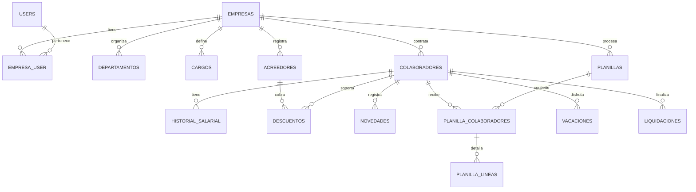
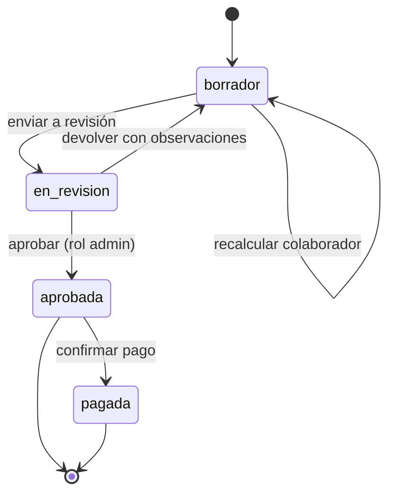

# Modelo de Datos del MVP: Nomix

**Documento:** `06_modelo_datos_mvp.md`  
**Proyecto:** **Nomix - Nómina inteligente**  
**Estado:** `ACCEPTED` (punto de partida; cambia con migraciones revisadas)  
**Base:** entidades observadas en [`docs/03_entities_and_data_model.md`](../03_entities_and_data_model.md), simplificadas para el MVP.

---

## 1. Convenciones

- **Claves primarias:** `id UUID` (UUIDv7, ordenable por tiempo).
- **Inquilino:** toda tabla de negocio tiene `empresa_id UUID NOT NULL` con RLS activado.
- **Montos:** `NUMERIC(14,2)`. **Tasas:** `NUMERIC(9,6)` (0.132500 = 13.25%). **Horas:** `NUMERIC(6,2)`.
- **Tiempos:** `created_at`, `updated_at` (`timestamptz`). Borrado lógico (`deleted_at`) solo en catálogos y colaboradores.
- **Enums:** columnas `text` con `CHECK` y un `enum` de PHP 8.1+ en la aplicación.
- **Cifrado:** 🔒 indica campo cifrado (AES-256-GCM, guardado como `bytea`). 🔎 indica que tiene blind index.

---

## 2. Diagrama

---

## 3. Tablas Globales (sin inquilino)

### `users`
| Columna | Tipo | Notas |
|---|---|---|
| `id` | uuid | |
| `nombre` | text | |
| `email` | citext único | |
| `password` | text | hash |
| `two_factor_secret` | text cifrado | Fortify |
| `two_factor_confirmed_at` | timestamptz | |

### `parametros_legales`
Tasas y valores del catálogo de reglas, con vigencia.

| Columna | Tipo | Notas |
|---|---|---|
| `id` | uuid | |
| `codigo` | text | p. ej. `CSS_PATRONAL_SALARIO` |
| `rule_id` | text | p. ej. `RULE-002` |
| `valor` | numeric(14,6) | nullable si se usa `valor_json`; exactamente uno de los dos |
| `valor_json` | jsonb | nullable; para tablas como los tramos de ISR. Los números van como string para no pasar por `float` |
| `vigente_desde` | date | nullable = vigente desde antes de lo documentado (p. ej. la cuota patronal histórica de 12.25%) |
| `vigente_hasta` | date | nullable = vigente hoy |
| `estado_verificacion` | text | `CONFIRMADO_SECUNDARIO`, `PARCIAL`, `PENDIENTE`, `VALIDADO` |
| `fuente` | text | Ley, artículo, enlace |

Restricciones (migración `create_parametros_legales_table`, NMX-006):
- `parametros_legales_vigencia_sin_cruce`: `EXCLUDE USING gist (codigo WITH =, daterange(vigente_desde, vigente_hasta, '[]') WITH &&)`. Dos vigencias del mismo `codigo` no pueden cruzarse; los extremos abiertos cuentan como infinitos.
- Índice único `(codigo, vigente_desde) NULLS NOT DISTINCT`: identidad de cada fila para el seeder.
- `CHECK` de formato de `rule_id` (`RULE-000`), de los estados admitidos, de "valor o tabla, no ambos" y de `vigente_hasta >= vigente_desde`.
- Es una tabla global: sin `empresa_id` ni RLS. Los valores los carga `ParametrosLegalesSeeder` con el rol de migraciones (`migrate --seed`); los códigos están en `App\Domain\Shared\Legal\LegalParameterCode`.

### `feriados`, `salarios_minimos`, `bancos`
Catálogos nacionales con vigencia (RULE-021, RULE-060) y la lista de bancos con su código ACH.

---

## 4. Tablas por Empresa

### `empresas`
| Columna | Tipo | Notas |
|---|---|---|
| `id` | uuid | Es el `empresa_id` de las demás tablas |
| `razon_social` | text | |
| `ruc`, `dv` | text | Validar formato |
| `numero_patronal_css` | text | |
| `tasa_riesgo_profesional` | numeric(9,6) | RULE-007 (con historial en `empresa_parametros`) |
| `region_salario_minimo` | text | `1` o `2` (RULE-060) |
| `actividad_economica` | text | Para salario mínimo y riesgo profesional |
| `banco_ach_id` | uuid | Banco pagador |
| `tolerancia_minutos`, `minimo_minutos_hora_extra` | int | Configuración |
| `dek_cifrada` | bytea | Clave de datos de la empresa, cifrada con el KMS |

### `empresa_user`
`empresa_id`, `user_id`, `rol` (`admin`, `operador_planilla`, `consulta`).

### `departamentos`, `cargos`, `sucursales`
Catálogos simples: `id`, `empresa_id`, `nombre`, `activo`.

### `colaboradores`
| Columna | Tipo | Notas |
|---|---|---|
| `id`, `empresa_id` | uuid | |
| `codigo` | text | Único por empresa |
| `nombres`, `apellidos` | text | |
| `tipo_identificacion` | text | `cedula`, `pasaporte` |
| `cedula` 🔒🔎 | bytea | Más `cedula_bidx text` (único por empresa) |
| `numero_seguro_social` | text | |
| `fecha_nacimiento` | date | |
| `sexo`, `estado_civil` | text | |
| `departamento_id`, `cargo_id`, `sucursal_id` | uuid | |
| `tipo_contrato` | text | `indefinido`, `definido`, `obra_determinada` |
| `fecha_ingreso` | date | |
| `fecha_fin_contrato` | date | nullable |
| `periodicidad_pago` | text | `quincenal`, `bisemanal`, `mensual` |
| `horas_semanales` | numeric(6,2) | |
| `jornada` | text | `diurna`, `nocturna`, `mixta` |
| `gastos_representacion` | numeric(14,2) | RULE-012 |
| `declara_isr` | bool | |
| `parametros_isr` | jsonb | Deducciones según RULE-011, cuando se valide |
| `forma_pago` | text | `ach`, `cheque`, `efectivo` |
| `banco_id` | uuid | |
| `tipo_cuenta` | text | `ahorro`, `corriente` |
| `numero_cuenta` 🔒 | bytea | |
| `estado` | text | `activo`, `vacaciones`, `licencia`, `suspendido`, `cesante` |

> **El salario no está en esta tabla.** Vive en `historial_salarial` para poder calcular periodos pasados con el salario que regía entonces.

### `historial_salarial`
| Columna | Tipo | Notas |
|---|---|---|
| `id`, `empresa_id`, `colaborador_id` | uuid | |
| `salario_base` 🔒 | bytea | Cifrado decimal |
| `vigente_desde` | date | |
| `motivo` | text | `ingreso`, `aumento`, `ajuste` |

### `acreedores` y `descuentos`
- `acreedores`: `id`, `empresa_id`, `nombre`, `tipo` (`comercial`, `judicial`, `pension_alimenticia`, `otro`).
- `descuentos`: `colaborador_id`, `acreedor_id`, `monto_por_periodo`, `monto_total` (nullable), `saldo`, `frecuencia` (`cada_pago`, `primera_quincena`, `segunda_quincena`), `aplica_xiii_mes`, `fecha_inicio`, `fecha_fin`, `estado`, `prioridad` (RULE-070).

### `novedades`
Hechos del período que afectan el cálculo.

| Columna | Tipo | Notas |
|---|---|---|
| `colaborador_id`, `empresa_id` | uuid | |
| `fecha` | date | |
| `tipo` | text | `hora_extra`, `ausencia`, `tardanza`, `incapacidad`, `bono`, `comision`, `otro_ingreso`, `otro_descuento` |
| `subtipo` | text | p. ej. recargo de hora extra (`diurna_25`, `nocturna_50`, `extension_75`) |
| `cantidad` | numeric(8,2) | Horas o días |
| `monto` | numeric(14,2) | Si aplica |
| `planilla_id` | uuid | nullable; se asigna al incluirse en una planilla |

### `planillas`
| Columna | Tipo | Notas |
|---|---|---|
| `id`, `empresa_id` | uuid | |
| `tipo` | text | `regular`, `xiii_mes`, `vacaciones`, `liquidacion`, `ajuste` |
| `periodicidad` | text | |
| `periodo_inicio`, `periodo_fin`, `fecha_pago` | date | |
| `estado` | text | Ver sección 5 |
| `totales` | jsonb | Resumen calculado (bruto, deducciones, neto, cargas patronales) |
| `aprobada_por`, `aprobada_en` | uuid, timestamptz | |
| `planilla_origen_id` | uuid | Para planillas de ajuste |

### `planilla_colaboradores`
Una fila por colaborador en la planilla, con el **snapshot** de los datos usados.

| Columna | Tipo | Notas |
|---|---|---|
| `planilla_id`, `colaborador_id`, `empresa_id` | uuid | |
| `snapshot` | jsonb | Datos del colaborador y parámetros legales usados (sin campos sensibles en claro) |
| `bruto`, `total_deducciones`, `neto`, `total_patronal` | numeric(14,2) | |
| `calculado_en` | timestamptz | |
| `version` | int | Sube en cada recálculo (bloqueo optimista) |

### `planilla_lineas`
| Columna | Tipo | Notas |
|---|---|---|
| `planilla_colaborador_id`, `empresa_id` | uuid | |
| `concepto` | text | `salario`, `hora_extra`, `css_obrero`, `se_obrero`, `isr`, `descuento`, `css_patronal`... La lista completa y su categoría están en `App\Domain\Payroll\Result\Concept` (NMX-010) |
| `categoria` | text | `ingreso`, `deduccion_ley`, `descuento`, `carga_patronal` |
| `monto` | numeric(14,2) | |
| `rule_id` | text | `RULE-xxx` |
| `traza` | jsonb | Fórmula, entradas y resultado (`RuleTrace::toArray()`). Las entradas sensibles, como el salario base, se guardan sin valor |

### `vacaciones` y `liquidaciones`
- `vacaciones`: `colaborador_id`, `periodo_desde`, `periodo_hasta`, `dias_ganados`, `dias_tomados`, `fecha_inicio_goce`, `planilla_id`.
- `liquidaciones`: `colaborador_id`, `causal` (RULE-053), `fecha_terminacion`, `planilla_id`, `resultado jsonb` (rubros con traza).

### `audit_logs`
Solo inserción. Ver la sección 2.8 de [05_arquitectura_codigo_y_convenciones.md](05_arquitectura_codigo_y_convenciones.md).

---

## 5. Estados de una Planilla

- En `borrador` se puede editar y recalcular libremente.
- Desde `aprobada` la planilla es **inmutable** (lo garantiza la aplicación y un *trigger* en BD). Las correcciones van en una planilla de tipo `ajuste`.
- Al aprobar se generan, en cola, los comprobantes PDF y el archivo ACH.

---

## 6. Decisiones de Diseño y Compromisos

1. **Montos de planilla sin cifrar.** `planilla_colaboradores` y `planilla_lineas` guardan montos en claro para poder sumar y reportar con SQL. Revelan el salario, así que su protección es RLS, permisos por rol y auditoría. El salario base y la cuenta bancaria sí van cifrados.
2. **Snapshot en cada planilla.** Se guarda qué datos y parámetros se usaron. Así una planilla vieja se puede explicar aunque el colaborador o la ley cambien después.
3. **Historial salarial separado.** Necesario para recálculos históricos, XIII mes, vacaciones y liquidaciones, que dependen de salarios pasados.
4. **Dependen del catálogo legal:** las columnas `parametros_isr`, la base de vacaciones y los rubros de liquidación pueden cambiar cuando se validen las reglas `PENDIENTE`.
